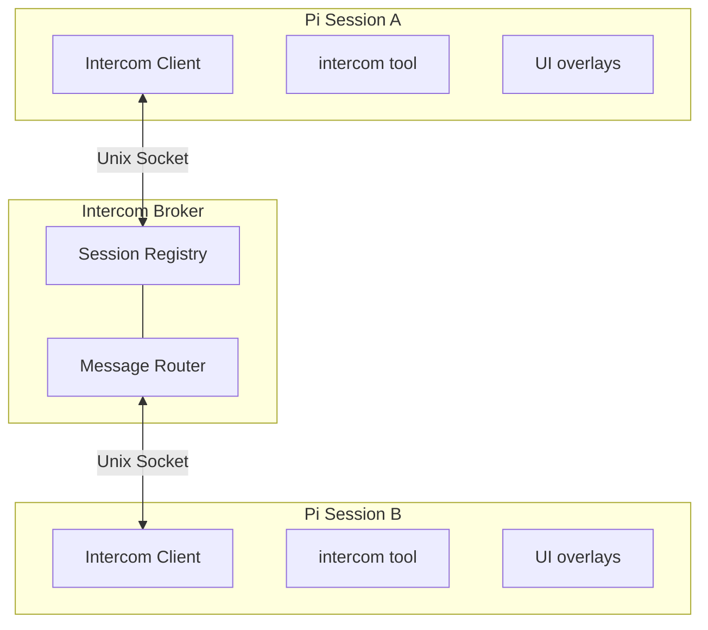

<p>
  
</p>

# Pi Intercom

Direct 1:1 messaging between pi sessions on the same machine. Send context, findings, or requests from one session to another — whether you're driving the conversation or letting agents coordinate.

```typescript
intercom({ action: "send", to: "research", message: "Found the bug in auth.ts:142" })
```

## Why

Sometimes you're running multiple pi sessions — one researching, one executing, one reviewing. Pi-intercom lets you:

- **User-driven orchestration** — Send context or findings from your research session to your execution session
- **Agent collaboration** — An agent can reach out to another session when it needs help or wants to share results
- **Session awareness** — See what other pi sessions are running and their current status

Unlike pi-messenger (a shared chat room for multi-agent swarms), pi-intercom is for targeted 1:1 communication where you pick the recipient.

## Install

The extension lives at `~/.pi/agent/extensions/pi-intercom/`. Install dependencies and restart pi:

```bash
cd ~/.pi/agent/extensions/pi-intercom
npm install
```

Then restart pi. The extension auto-connects to the broker on startup.

## Quick Start

### From the Keyboard

Press **Alt+M** or type `/intercom` to open the session list overlay:

1. **Select a session** — Use arrow keys to pick a target session
2. **Compose message** — Write your message in the compose overlay
3. **Send** — Press Enter to send, Escape to cancel

### From the Agent

The agent can list sessions and send messages using the `intercom` tool:

```typescript
// List active sessions
intercom({ action: "list" })
// → • research — ~/projects/api (claude-sonnet-4) [researching]
// → • executor — ~/projects/api (claude-sonnet-4) [idle]

// Send a message
intercom({ action: "send", to: "research", message: "Check if UserService.validate() handles null" })
// → Message sent to research

// Check connection status
intercom({ action: "status" })
// → Connected: Yes, Session ID: abc123, Active sessions: 3
```

### Receiving Messages

When a message arrives, it appears inline in your chat with the sender's info and a reply hint:

```
**📨 From research** (~/projects/api) — reply: intercom({ action: "send", to: "research", message: "..." })

Found the issue — UserService.validate() doesn't check for null input.
See auth.ts:142-156.
```

The reply hint (enabled by default) shows the exact `intercom()` call to respond. The message triggers a new turn, so the agent can respond or act on it immediately.

## Tool Reference

### intercom

| Parameter | Type | Description |
|-----------|------|-------------|
| `action` | string | `"list"`, `"send"`, or `"status"` |
| `to` | string | Target session name or ID (for send) |
| `message` | string | Message text (for send) |
| `attachments` | array | Optional file/snippet attachments |
| `replyTo` | string | Optional message ID for threading |

### Actions

**`list`** — Returns all active sessions (excluding self) with name, working directory, model, and status.

**`send`** — Sends a message to the specified session. By default, shows a confirmation dialog (disable with `autoSend: true` in config). Returns delivery confirmation.

**`status`** — Shows connection status, session ID, and count of active sessions.

## Keyboard Shortcuts

| Key | Action |
|-----|--------|
| Alt+M | Open session list overlay |
| ↑/↓ | Navigate session list |
| Enter | Select session / Send message |
| Escape | Cancel / Close overlay |

## Config

Create `~/.pi/agent/intercom/config.json`:

```json
{
  "autoSend": false,
  "enabled": true,
  "replyHint": true,
  "status": "researching"
}
```

| Setting | Default | Description |
|---------|---------|-------------|
| `autoSend` | false | Skip confirmation dialog when agent sends messages |
| `enabled` | true | Enable/disable intercom entirely |
| `replyHint` | true | Include reply instruction in incoming messages |
| `status` | — | Custom status shown to other sessions |

## How It Works



The broker is a standalone TypeScript process that manages session registration and message routing. It auto-spawns when the first session needs it and exits after 5 seconds when the last session disconnects.

Messages use length-prefixed JSON over Unix sockets (4-byte length + JSON payload) to handle fragmentation properly.

Runtime files live at `~/.pi/agent/intercom/`:
- `broker.sock` — Unix socket for communication
- `broker.pid` — Broker process ID
- `config.json` — User configuration

## pi-intercom vs pi-messenger

| Aspect | pi-intercom | pi-messenger |
|--------|-------------|--------------|
| **Model** | Direct 1:1 messaging | Shared chat room |
| **Primary use** | User orchestrating sessions | Autonomous agent coordination |
| **Discovery** | Broker-based (real-time) | File-based registry |
| **Messages** | Private, session-to-session | Broadcast to all agents |
| **Persistence** | In sender & receiver history | Shared coordination files |

Use pi-messenger for multi-agent swarms working on a shared task. Use pi-intercom when you want to manually coordinate your own sessions or have one agent reach out to another specific session.

## File Structure

```
~/.pi/agent/extensions/pi-intercom/
├── package.json
├── index.ts           # Extension entry point (343 lines)
├── types.ts           # SessionInfo, Message, protocol types
├── config.ts          # Config loading
├── broker/
│   ├── broker.ts      # Broker process (228 lines)
│   ├── client.ts      # IntercomClient class (344 lines)
│   ├── framing.ts     # Length-prefixed JSON protocol
│   └── spawn.ts       # Auto-spawn logic with lock file
└── ui/
    ├── session-list.ts    # Session selection overlay
    ├── compose.ts         # Message composition overlay
    └── inline-message.ts  # Received message display
```

## Limitations

- **Same machine only** — Uses Unix sockets, no network support
- **No message history** — Messages appear inline but aren't persisted to a log file
- **No attachments UI** — File/snippet attachments are supported in the protocol but not exposed in the compose overlay
- **Broker must be running** — Auto-spawns, but if it crashes, sessions need to reconnect (happens on next action)
